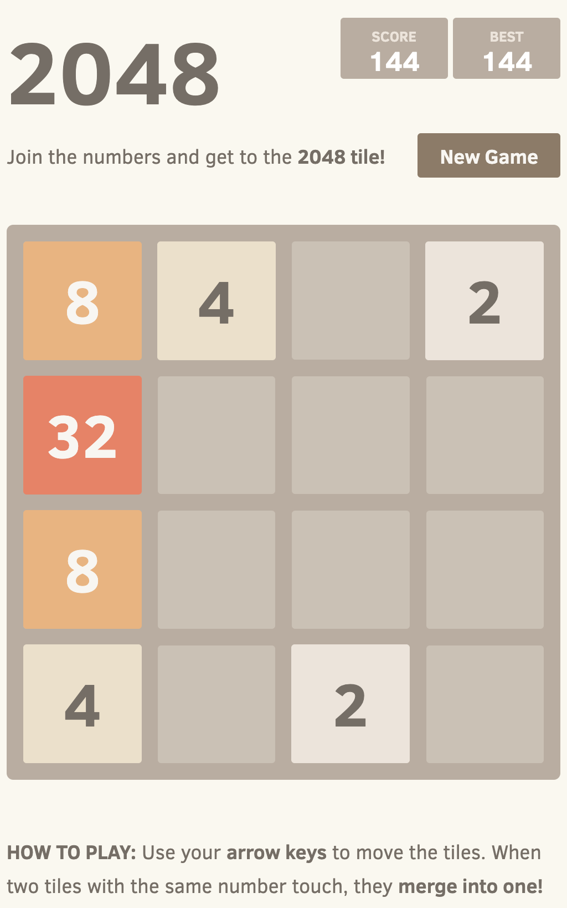

# Lab 1: Add a Feature

In this lab, you're going to add a feature to your game.

## Scenario

Currently, the game functions as expected, however players don't know how it
works. We need to add the rules of the game so that players know what to do and
how to win.

## Task 1: Create a Branch

Before you start adding a feature, you should create a branch to work on.

1. Open the terminal or command prompt
1. Create and checkout a new branch

   ```bash
   git checkout -b feature/rules
   ```

## Task 2: Add the Rules

The rules for the game are simple, but they should be displayed so new players
know what to do.

1. Open [`index.html`](../index.html)
1. Locate the comment `<!-- Lab 1: Add Game Rules -->`
1. Add the following code below the comment

   ```html
   <p class="game-explanation">
     <strong class="important">How to play:</strong>
     Use your <strong>arrow keys</strong> to move the tiles. When two tiles with
     the same number touch, they <strong>merge into one!</strong>
   </p>
   ```

1. Save the file

## Task 3: Test the Feature

Before you commit your changes, you should test the feature to make sure it
works as expected.

1. Open [`index.html`](../index.html) in your web browser
1. Verify the rules are displayed

   

## Task 4: Commit your Changes

Now that you've tested the feature, you should commit your changes to your
feature branch.

1. Open the terminal or command prompt
1. Add your changes to the staging area

   ```bash
   git add index.html
   ```

1. Commit your changes

   ```bash
   git commit -m 'Add game rules to index.html'
   ```

## Task 5: Switch to the `main` Branch

Now that you've added the feature, you should switch back to the `main` branch
so you can start working on something new!

1. Checkout the `main` branch

   ```bash
   git checkout main
   ```

## Task 6: Merge the `feature/rules` Branch

Now that you're on the `main` branch, you should merge the `feature/rules`
branch into the `main` branch. That way, when your changes are pushed, the rules
will be displayed on GitHub Pages the next time you refresh.

1. Merge the `feature/rules` branch into the `main` branch

   ```bash
   git merge feature/rules
   ```

1. Push your changes to GitHub

   ```bash
   git push
   ```

1. Navigate to your repository on GitHub.com
1. Click the **Actions** tab
1. Click the running **Deploy to GitHub Pages** workflow
1. Wait for the workflow run to complete
1. Click the **Code** tab
1. Click the link to your game
1. Verify the rules are now displayed on the game page

## Need Help?

If you're having trouble with any of the steps, you can ask for help in the
meeting chat.

The code changes for this lab can be found in the `solutions` directory.

- Copy the contents of
  [`solutions/1-add-a-feature/index.html`](../solutions/1-add-a-feature/index.html)
  and replace the contents of [`index.html`](../index.html)
