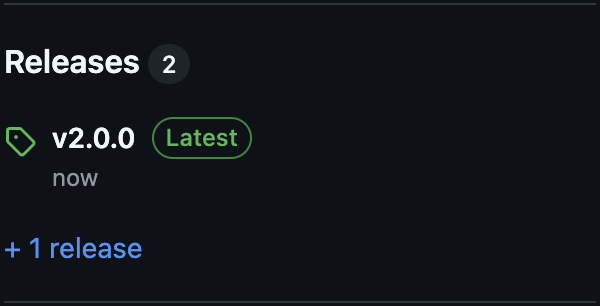
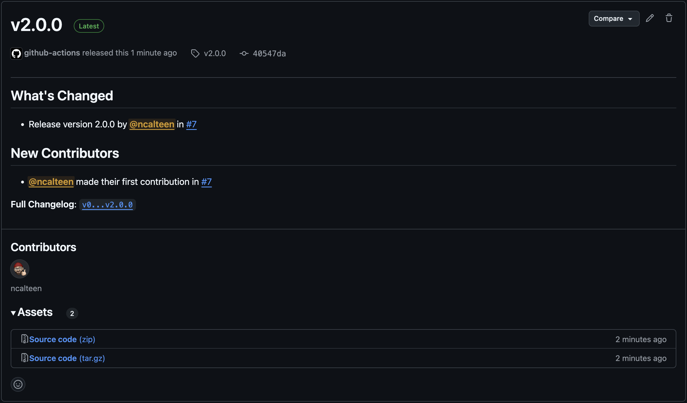

# Lab 10: Create a Release

In this lab, we will create our first major release of our application.

## Scenario

So far, we have created and merged several PRs, but how can we actually keep
track of released changes? We can use GitHub Releases to create a new release
for each version of our application. This will allow us to keep track of the
changes that have been made, and also to provide a changelog for our users.

## Task 1: Create a Feature Branch

1. Ensure that you are on the `main` branch

   ```bash
   git checkout main
   ```

1. Create a new release branch

   ```bash
   git checkout -b release/v2.0.0
   ```

## Task 2: Update the Release Version

This repository uses several open-source actions to automate the creation of
releases and changelogs. In order to generate a release, you will need to update
the version number in the `package.json` file.

1. Open the [`package.json`](../package.json) file in your editor
1. Change the value of the `version` key to `2.0.0`

   ```jsonc
   {
     "name": "@githubschool/gh-github-intermediate-template",
     "description": "GitHub Intermediate Training - Template",
     "version": "2.0.0",
     // ...
   ```

1. Save the file
1. Commit the changes

   ```bash
   git add package.json
   git commit -m "Release version 2.0.0"
   ```

1. Push the `release/v2.0.0` branch to GitHub

   ```bash
   git push
   ```

## Task 3: Open a Pull Request

1. In your browser, navigate to your repository on GitHub
1. Click on the **Pull requests** tab
1. Click the **New pull request** button
1. Click the **Compare** button, then select your `release/v2.0.0` branch
1. Click **Create pull request**
1. Enter a title and description for your PR
1. Click **Create pull request**

   At this point, your PR will not be able to be merged. Someone in the class
   will need to review it first.

1. Copy the URL of your PR and paste it into the meeting chat

## Task 4: Review a Pull Request (Approve)

As other people in the class post their PRs, try to review and approve one.

1. Click on the link to a PR in the meeting chat
1. Click on the **Files changed** tab
1. Click the **Review changes** button
1. Enter a comment
1. Ensure **Approve** is selected as the review type
1. Click **Submit review**

   

## Task 5: Merge the Pull Request

Once your PR has been approved, you can merge it into `main`.

1. Click the **Merge pull request** button
1. Click **Confirm merge**
1. Click **Delete branch**

## Task 6: Review the Workflow Run

1. In your browser, navigate to your repository on GitHub
1. Click the **Actions** tab
1. Click the **Continuous Delivery** workflow
1. Click the **Release Node.js Project** step
1. Review the output of each of the following steps

   - Checkout
   - Setup GitHub Pages
   - Upload Artifact
   - Tag
   - Create Release

## Task 7: View the Release

1. In your browser, navigate to your repository on GitHub
1. Click on the **v2.0.0** link in the **Releases** section

   

1. Review the auto-generated release notes

   

## Need Help?

If you're having trouble with any of the steps, you can ask for help in the
meeting chat.
