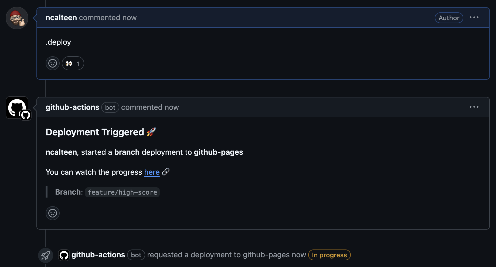
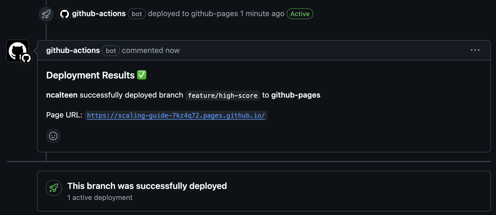
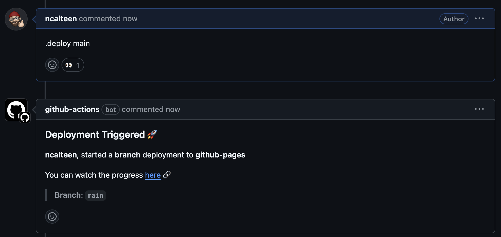
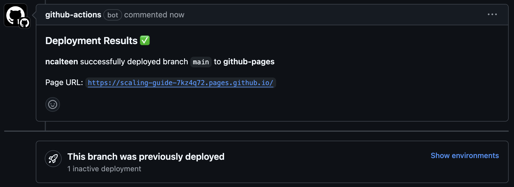
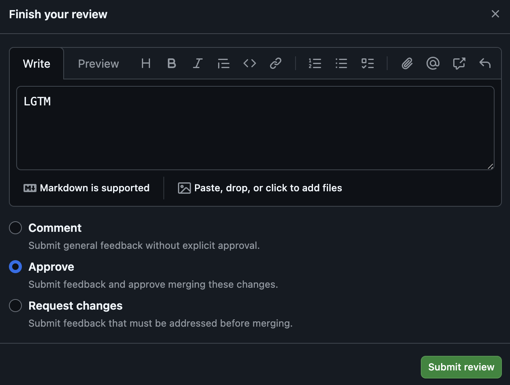

# Lab 11: Deploy to an Environment

In this lab, you will use pull request comments to trigger deployments to your
GitHub Pages environment. This lets you temporarily deploy a branch to GitHub
Pages to preview changes before merging the pull request.

## Scenario

By the time you are working on this lab, you should have a fully-functional game
deployed to GitHub pages. You should also have a workflow that deploys the game
to a GitHub Pages environment when a pull request is merged.

However, how can you preview changes before they are merged? What if you need to
quickly roll a change back? This is where repository environments come into
play. By specifying the `environment` property in a workflow, you can trigger
deployments that are marked as successful/failed based on the result of the
workflow run. Combining this with the ability to trigger workflows using pull
request comments, you can create a workflow that deploys a branch to an
environment when a comment is made on a pull request (often referred to as
[IssueOps](https://github.blog/engineering/engineering-principles/enabling-branch-deployments-through-issueops-with-github-actions/)).

## Task 1: Create a Feature Branch

1. Ensure you are on the `main` branch

   ```bash
   git checkout main
   ```

1. Create a new feature branch

   ```bash
   git checkout -b feature/high-score
   ```

1. Open the [`src/local_storage_manager.ts`](../src/local_storage_manager.ts)
   file
1. Locate the comment `// Lab 11: Update Best Score`
1. Add the following code below the comment

   ```ts
   LocalStorageManager.storage.setItem('bestScore', score.toString())
   ```

1. Save the file
1. Commit the changes

   ```bash
   git add .
   git commit -m 'Save best score to local storage'
   ```

1. Push the changes to GitHub

   ```bash
   git push
   ```

## Task 2: Open a Pull Request

1. In your browser, navigate to your repository on GitHub
1. Click on the **Pull requests** tab
1. Click the **New pull request** button
1. Click the **Compare** button, then select your `feature/high-score` branch
1. Click **Create pull request**
1. Enter a title and description for your PR
1. Click **Create pull request**

## Task 3: Deploy to the `github-pages` Environment

1. In the pull request, navigate to the **Add a comment** section
1. In the comment text field, enter `.deploy`

   In a few seconds, you should see a comment is automatically to the pull
   request stating a deployment is in progress. You should also see that a
   deployment has been initiated.

   

1. Wait for the deployment to complete

   Another comment will be added to the pull request with a link to the
   deployment.

   

1. Click the link to view the deployed game

   As you play the game, your high score should now be saved in the **BEST**
   box.

   

## Task 4: Roll Back the Deployment

In this scenario, we only have one environment, so we can only have one active
version of the game at a time. For now, lets roll back the changes until the PR
is merged.

1. In the pull request, navigate to the **Add a comment** section
1. In the comment text field, enter `.deploy main`

   In a few seconds, you should see a comment is automatically to the pull
   request stating a deployment is in progress. You should also see that a
   deployment has been initiated.

   

1. Wait for the deployment to complete

   Another comment will be added to the pull request with a link to the rollback
   deployment.

   

1. Click the link to view the deployed game

   As you play the game, your high score should no longer be saved.

## Task 5: (Optional) Review a Pull Request

Feel free to follow the below steps to request and review each other's PRs.

1. Copy the URL of your PR and paste it into the meeting chat
1. Click on another PR link in the meeting chat
1. Click on the **Files changed** tab
1. Click the **Review changes** button
1. Enter a comment
1. Ensure **Approve** is selected as the review type
1. Click **Submit review**

   

## Task 6: (Optional) Merge the Pull Request

Once your PR has been approved, you can merge it into `main`.

1. Click the **Merge pull request** button
1. Click **Confirm merge**
1. Click **Delete branch**

After 1-2 minutes, the changes will be deployed automatically to GitHub Pages!

## Need Help?

If you're having trouble with any of the steps, you can ask for help in the
meeting chat.
