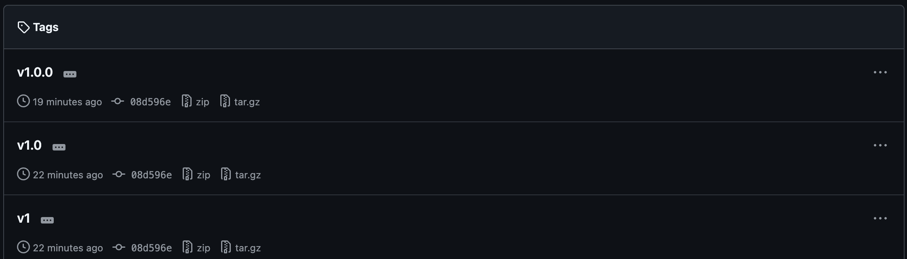
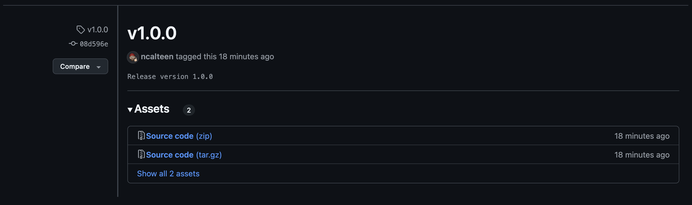

# Lab 2: Tag a Release

In this lab, you're going to add tags to denote releases for your game.

## Scenario

As you make changes to your game, you'll want to tag released versions so that
players can download a specific version of the game. This will allow you to
easily track which version of the game is currently live and which version is in
development. It will also help with troubleshooting and debugging issues that
arise.

## Task 1: Locate a Commit

When you create tags, they point to specific commits. You can create tags for
any commit, but it's common to create tags for commits that represent a released
version of your game.

1. Open the terminal or command prompt
1. List the commits in your repository

   ```bash
   git log --oneline
   ```

1. Copy the commit hash for the commit you want to tag

   In this example, you would use the commit hash `f27298a`.

   ```plain
   f27298a (HEAD -> main, origin/main) Add game rules to index.html
   503d006 Add badges
   6379deb Update dependencies
   92f12c2 Add CI workflow
   d57f3f7 Add linting workflow
   59012dc Add deploy-pages workflow
   ...
   ```

## Task 2: Tag the Commit

Create several tags so that developers can find the major, minor, and patch
versions of the game.

1. Open the terminal or command prompt
1. Create an annotated tag

   Make sure to replace `<sha>` with the commit hash you copied in the previous
   step.

   ```bash
   git tag -a v1.0.0 -m "Release version 1.0.0" <sha>
   ```

1. Create lightweight tags for the major and minor versions

   Make sure to replace `<sha>` with the commit hash you copied in the previous
   step.

   ```bash
   git tag v1.0 <sha>
   git tag v1 <sha>
   ```

## Task 3: Push the Tags to GitHub

Later in this training, you'll learn about creating GitHub releases and how they
interact with tags. For now, you'll simply push the tags to GitHub.

1. Open the terminal or command prompt
1. Push the tags to GitHub

   ```bash
   git push --tags
   ```

1. Navigate to your repository on GitHub.com
1. Click the **Code** tab
1. Click the **Tags** button
1. Verify the tags are present

   

1. Click the **v1.0.0** tag to view the annotated tag notes

   

## Need Help?

If you're having trouble with any of the steps, you can ask for help in the
meeting chat.
