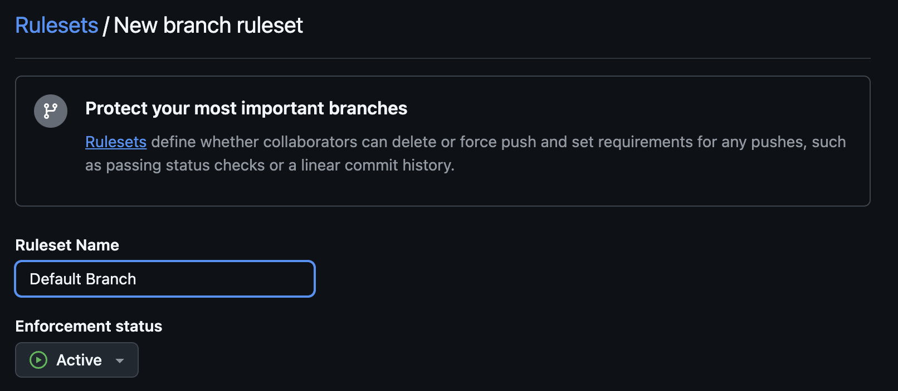
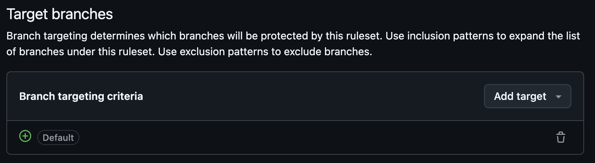
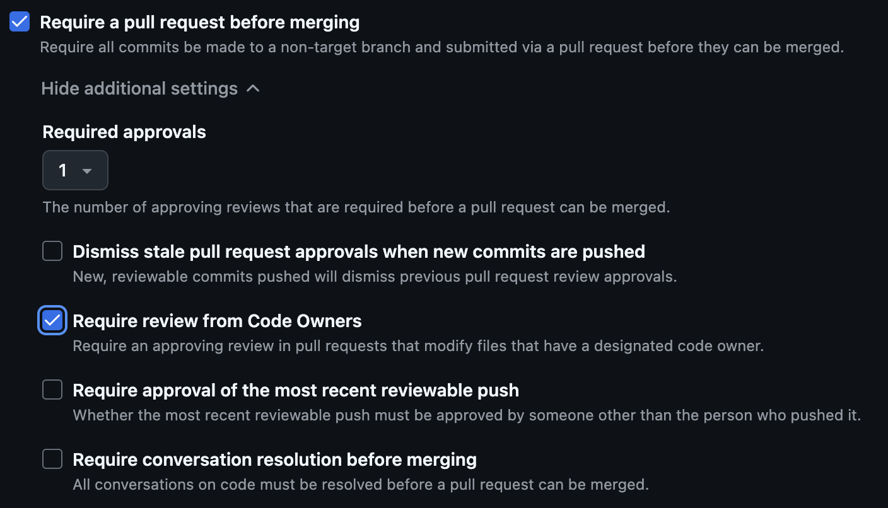

# Lab 6: Protect the `main` Branch

In this lab, we're going to add a `CODEOWNERS` file, enable branch protections,
and see what happens when we try to push any changes directly to `main`.

## Scenario

Up until this point, we've been pushing changes directly to the default branch,
`main`. When working with multiple developers in the same repo(s), this can
cause many conflicts and other problems.

## Task 1: Create a `CODEOWNERS` File

1. Ensure you're working on the `main` branch

   ```bash
   git checkout main
   ```

1. At the root of the repository, create a new file named `CODEOWNERS` with the
   following contents

   Replace `your-username` with your GitHub usernam. Make sure to leave the `@`
   symbol!

   ```plain
   # Game Project Code Owners

   * @your-username
   ```

1. Add the `CODEOWNERS` file to the repository

   ```bash
   git add CODEOWNERS
   git commit -m "Add CODEOWNERS file"
   ```

1. Push the changes to GitHub

   ```bash
   git push
   ```

## Task 2: Protect the `main` Branch

1. In your browser, navigate to your repository on GitHub
1. Click on the **Settings** tab
1. Expand **Rules**, then click **Rulesets**
1. Click **New ruleset**, then **New branch ruleset**
1. In the **Ruleset name** text field, enter a name for your rulset (e.g.
   `Default Branch`)
1. Set the **Enforcement status** to **Active**

   

1. In the **Target branches** section, click **Add target**, then click
   **Include default branch!**

   

1. In the **Rules** section, set the following:

   - **Require a pull request before merging:** Enabled
   - **Required approvals:** `1`
   - **Require review from Code Owners:** Enabled

   

1. Click **Create**

## Task 3: Try to Push Directly to `main`

Now that the `main` branch is protected, let's see what happens when we try to
push changes directly to `main`.

1. In your terminal, make sure you're on the `main` branch

   ```bash
   git checkout main
   ```

1. Make a change any file in the repository

   For example, you could add a new line to the `README.md` file

   ```markdown
   # GitHub Intermediate - Project Repository

   This is an update to the README.md file!
   ```

1. Add and commit the changes

   ```bash
   git add README.md
   git commit -m "Update README.md"
   ```

1. Push the changes to GitHub

   ```bash
   git push
   ```

   At this point, you should see an error message in your terminal, indicating
   that you cannot push changes directly to the `main` branch.

## Need Help?

If you're having trouble with any of the steps, you can ask for help in the
meeting chat.
