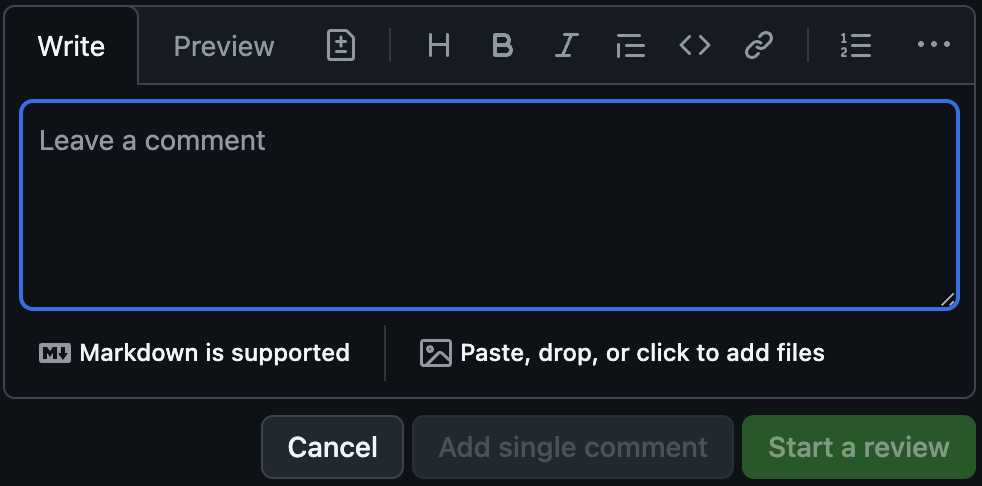
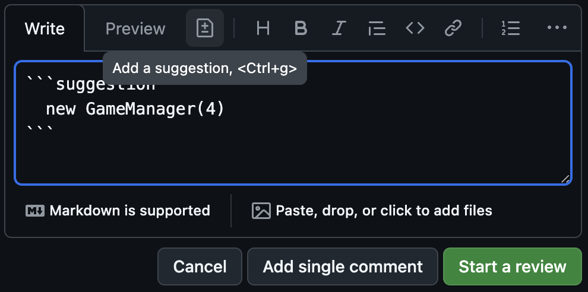
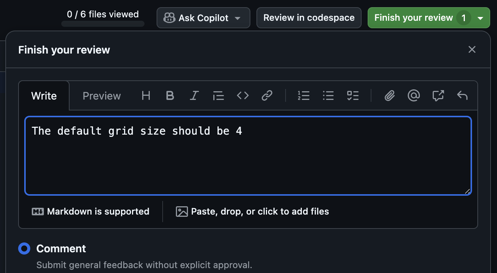
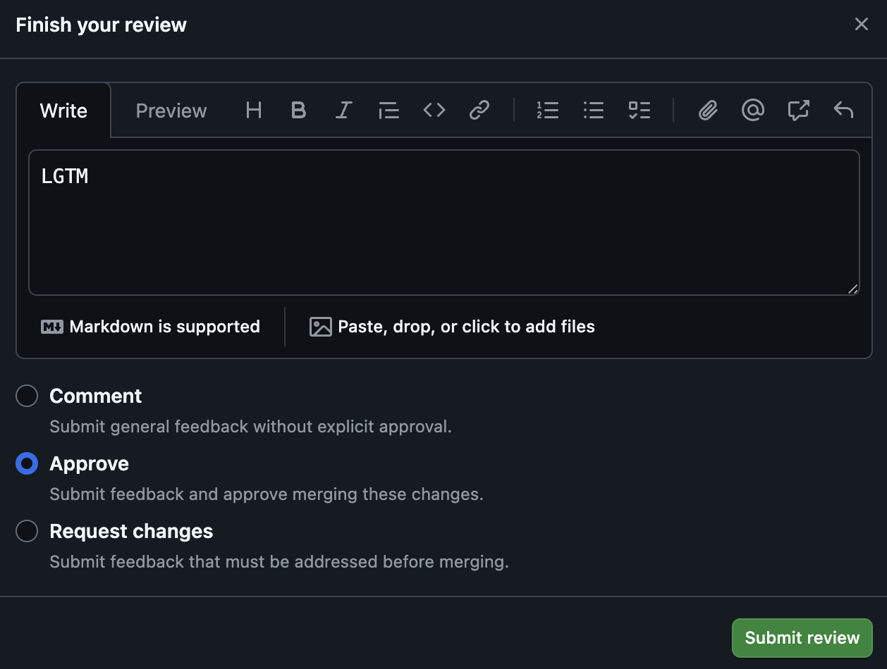

# Lab 7: GitHub Flow

Now that `main` is protected, you won't be able to commit and push changes
directly. Instead, you will need to create a feature branch and open a pull
request (PR). In this lab, you will create and review PRs for one another,
following
[GitHub flow](https://docs.github.com/en/get-started/using-github/github-flow).

## Scenario

As you've probably noticed by now, the game has a bug where any tiles in the
left- or bottom-most squares do not move. This must be fixed, but we want to
ensure that the fix is reviewed by at least one other person before it is merged
into `main`.

## Task 1: Create a Fix Branch

1. Ensure you're working on the `main` branch

   ```bash
   git checkout main
   ```

1. Create a new branch for the fix

   ```bash
   git checkout -b fix/stuck-tiles
   ```

## Task 2: Implement the Fix

1. Open [`src/application.ts`](../src/application.ts)
1. Locate the comment `// Lab 7: Grid Size`
1. Update the input parameter to `GameManager` to `5` instead of `3`

   ```ts
   // Lab 7: Grid Size
   new GameManager(5)
   ```

   > **Note:** Updating this to `5` is still not the right fix! We're going to
   > do this on purpose to see how we can fix it in a PR.

1. Save the file

## Task 3: Commit the Changes

1. Add the changes to the staging area

   ```bash
   git add src/application.ts
   ```

1. Commit the changes

   ```bash
   git commit -m "Increase grid input size to 5"
   ```

1. Push your branch to GitHub

   ```bash
   git push
   ```

## Task 4: Open a Pull Request

1. In your browser, navigate to your repository on GitHub
1. Click on the **Pull requests** tab
1. Click the **New pull request** button
1. Click the **Compare** button, then select your `fix/stuck-tiles` branch
1. Click **Create pull request**
1. Enter a title and description for your PR
1. Click **Create pull request**

   At this point, your PR will not be able to be merged. Someone in the class
   will need to review it first.

1. Copy the URL of your PR and paste it into the meeting chat

## Task 5: Review a Pull Request (Suggest Changes)

As other people in the class post their PRs, try to review one and provide
feedback. In particular, you should suggest a fix to the incorrect grid size
that was added in the PR.

1. Click on the link to a PR in the meeting chat

   Save this link, as you will need it later to approve the PR.

1. Click the **Files changed** tab
1. Next to the line that was changed in `src/application.ts`, click plus sign
   (`+`) to add a comment

   

1. Click the **Add a suggestion** button to suggest changing the input from `5`
   to `4`

   

1. Click **Start a review**
1. Click **Finish your review**
1. Add a comment to the PR suggesting the change
1. Ensure **Comment** is selected as the review type

   

1. Click **Submit review**

## Task 6: Implement the Suggested Change

When someone has reviewed your PR and suggested the change, you should implement
it and push the changes to your branch.

1. In your browser, navigate to your PR on GitHub
1. Scroll down to the comments and locate the one with the suggestion
1. Click the **Commit suggestion** button
1. Enter a commit message
1. Click **Commit changes**

## Task 7: Review a Pull Request (Approve)

Once the author of the PR you reviewed has implemented your suggestion, you
should review the PR again and approve it.

1. Open the link to the PR you reviewed previously
1. Click on the **Files changed** tab
1. Ensure that the suggestion you made is implemented correctly
1. Click the **Review changes** button
1. Enter a comment
1. Ensure **Approve** is selected as the review type
1. Click **Submit review**

   

## Task 8: Merge the Pull Request

Once your PR has been approved, you can merge it into `main`.

1. Click the **Merge pull request** button
1. Click **Confirm merge**
1. Click **Delete branch**

Congratulations! You've successfully contributed to projects using GitHub flow.

## Need Help?

If you're having trouble with any of the steps, you can ask for help in the
meeting chat.

The code changes for this lab can be found in the `solutions` directory.

- Copy the contents of
  [`solutions/7-github-flow/application.ts`](../solutions/7-github-flow/application.ts)
  and replace the contents of [`src/application.ts`](../src/application.ts)
