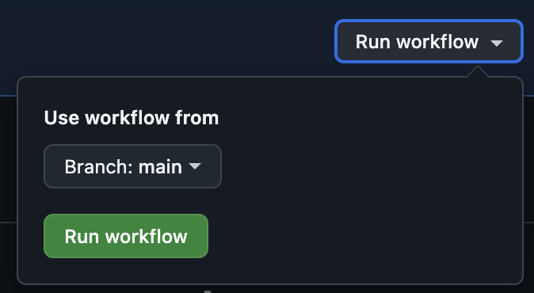

# Lab 9: Run a GitHub Actions Workflow

In this lab, you will manually run the **Continuous Integration** workflow and
review the generated logs.

## Scenario

Any time an event is triggered that workflows are looking for, they will be
invoked. You can also invoke workflows manually from the GitHub.com UI or via
the API.

## Task 1: Run the CI Workflow

1. In your browser, navigate to your repository on GitHub
1. Click the "Actions" tab
1. Click the "Continuous Integration" workflow
1. Ensure the **main** branch is selected
1. Click the "Run workflow" button

   

   A new workflow run will be started.

   

## Task 2: Review the Workflow Run Logs

1. Click the workflow run
1. Click the **Continuous Integration** step
1. Review the output of each of the following steps

   - Checkout
   - Setup Node.js
   - Install Dependencies
   - Check Format
   - Lint
   - Test

## Need Help?

If you're having trouble with any of the steps, you can ask for help in the
meeting chat.
